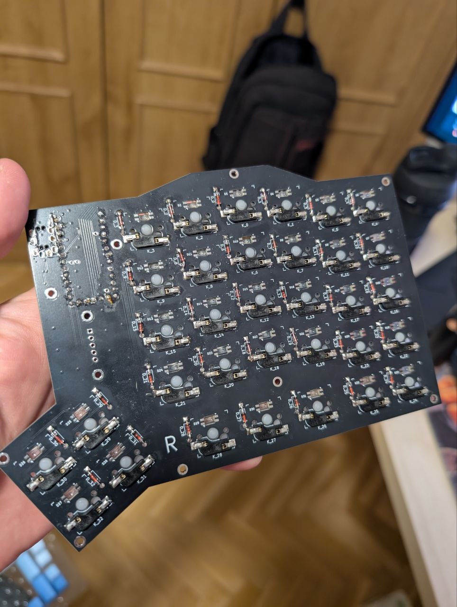
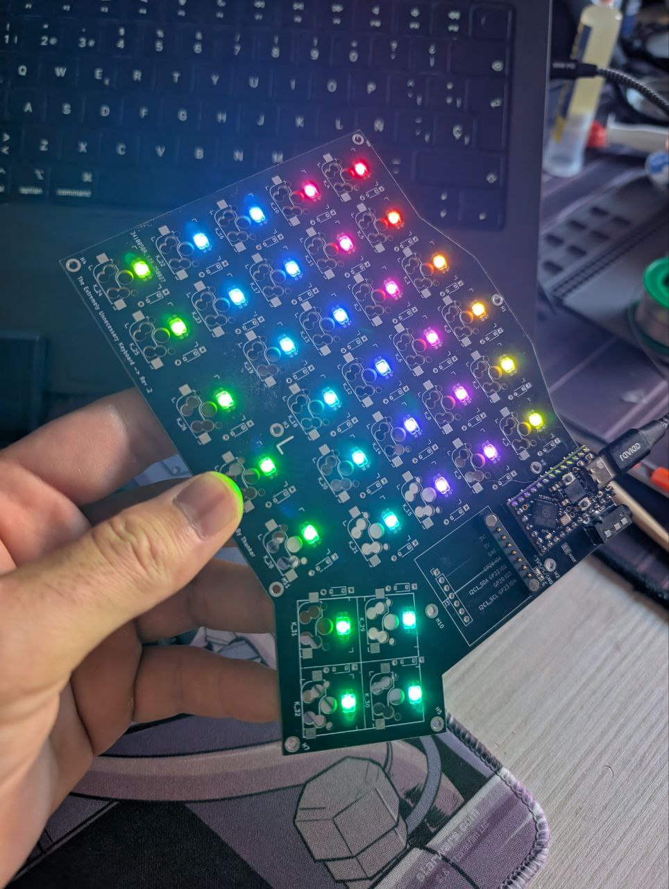
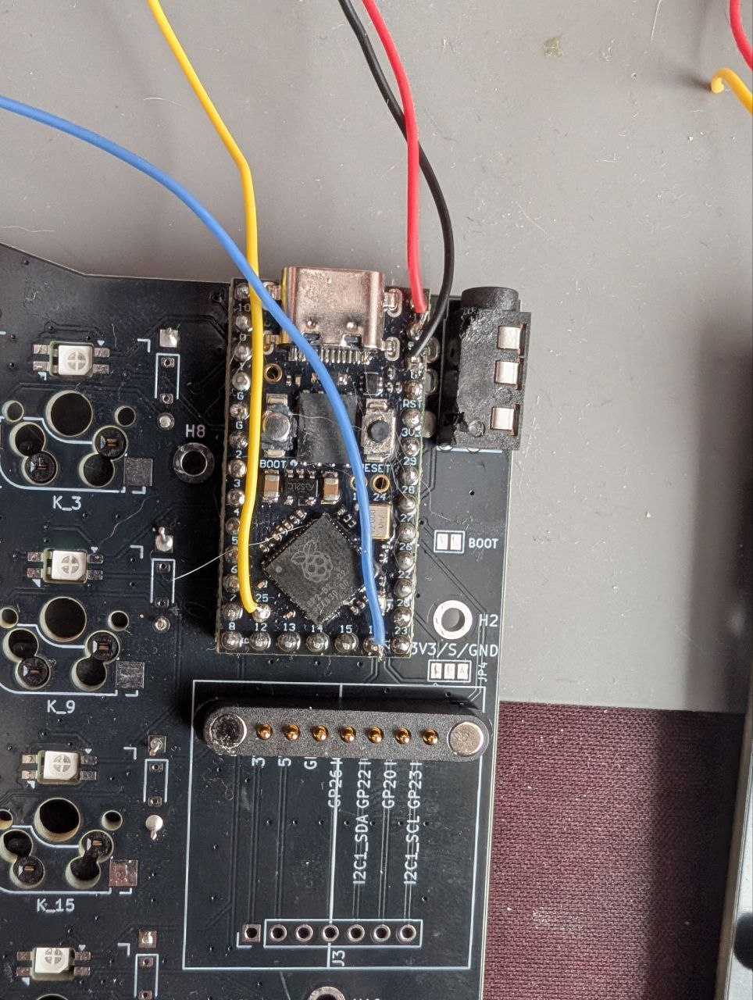
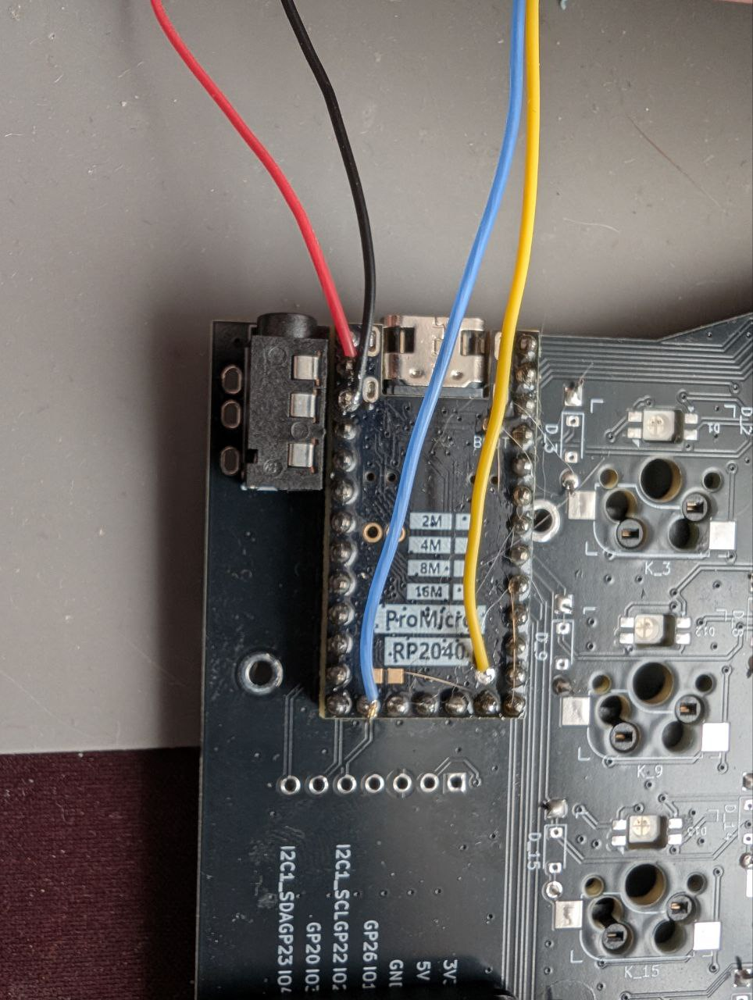

# Soldering

Pay close attention to the orientation of components and which side of the PCB you're actually assembling. Most of the soldering for a given side must be done from the OPPOSITE SIDE. Once assembled, everything except for the MCU, TRRS jack and magnetic connector will be the bottom of the board.

## LEDs

Painful to do by hand (not an oven) and with a soldering iron, but doable. LEDs are EXTREMELY EASY TO DAMAGE, so try to be gentle with the tool. The cut corner on the LED should be placed on the lower left corner.

## MCU

Do not use sockets, or the case will not fit. Solder the MCU directly using pin headers!
For the right hand, the MCU board should be soldered UPSIDE DOWN. There's an extra pin header needed for the boot pin, which will be exposed on the bottom of the board (the case has a hole for easy access).

After soldering the LEDs and the MCU, the test script under `sw/test` on this repo can be used to verify they work (it will display a rainbow effect)

## OLED screens

Must be soldered directly to the MCU pins (5V, GND, GPIO25/SCL, GPIO16/SDA).

