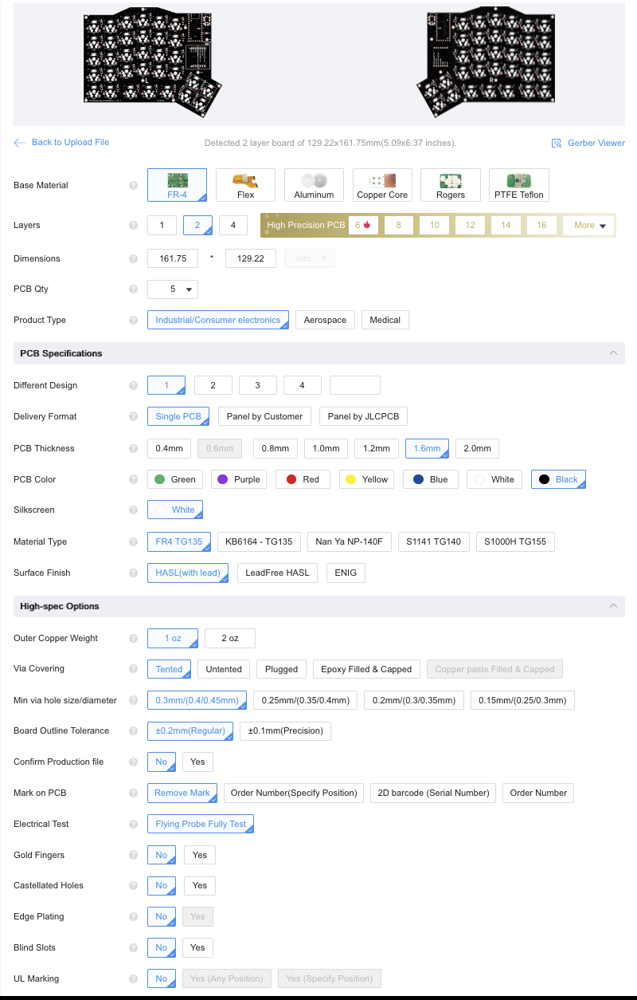

# JLCPCB

To keep manufacturing costs low, there's actually a single PCB in this project. Flip it around, you have the other hand! It follows that you at least need 2 PCBs to to assemble a single keyboard.

This project was created around JLCPCB's PCB assembly service. In the end, no SMD components are assembled from the factory, so any other PCB manufacturing service will do.

To order, just upload the production files under `pcb/jlcpcb/production_files` (GERBER .zip and BOM/CPL files). Keep ALL options in their default settings, except for the PCB color which can be selected according to taste (or lack thereof).

